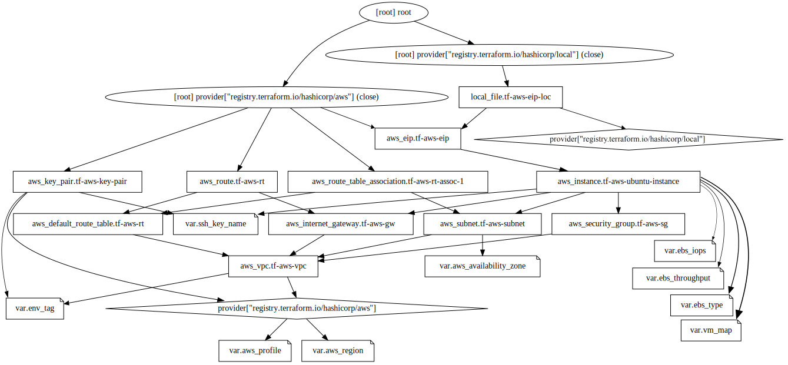

# RAPSQLBench

- [RAPSQLBench](#rapsqlbench)
  - [Prerequisites](#prerequisites)
  - [Terraform Infrastructure Graph](#terraform-infrastructure-graph)
  - [Benchmark Usage](#benchmark-usage)
  - [Repositories](#repositories)
  - [License](#license)
  - [Authors](#authors)

## Prerequisites

- [AWS Account](https://aws.amazon.com/premiumsupport/knowledge-center/create-and-activate-aws-account/)
- [AWS CLI](https://docs.aws.amazon.com/cli/latest/userguide/cli-chap-install.html)
- [Ansible](https://docs.ansible.com/ansible/latest/installation_guide/intro_installation.html#pip-install)
- [Terraform](https://learn.hashicorp.com/tutorials/terraform/install-cli)

## Terraform Infrastructure Graph


**Terraform AWS Cloud Infrastructure of RAPSQLBench.**

## Benchmark Usage

1. Clone this repository:

    ```bash
    git clone https://github.com/OpenSemanticWorld/rapsqlbench.git
    ```

2. Login to AWS via the CLI, e.g. using single sign-on (SSO):

    ```bash
    aws configure sso 
    ```

3. Change directory to `rapsqlbench/terraform` and run `terraform init` to initialize the Terraform configuration:

    ```bash
    cd rapsqlbench/terraform; terraform init
    ```

4. Setup your own Terraform configuraton in `variables.tf` (rsa pubkey for ssh).

5. Build the desired infrastructure using Terraform via `main.tf`, run

    ```bash
    terraform apply
    ```

    and confirm with `yes` if plan is correct and fullfills your requirements.

6. Configure your `RAPSQLBench` setup in `config.yml`.

7. Perform `RAPSQLBench` using Ansible via `deploy.yml` (ssh authorisation required), e.g. with vm name `vm50k` for 50k triple dataset from `terraform` directory`:

    ```bash
    ansible-playbook -i ./inventory/vm50k-eip.txt ../ansible/deploy.yml -e "@../ansible/config.yml"
    ```

    and confirm with `yes` if prompted for ssh fingerprint.

8. (Optional) To monitor the measurement files connect to remote vm via ssh, you can use the following command for a `graphname` defined in `ansible/config.yml`. Task `Perform benchmark` must be running in ansible first in order to provide the measurement file, which gives a live overview of all metrics. Notice that the generated performance results are extracted from the postgres timings and differ from the results of the measurement file due to small script overhead of the benchmark procedure.

    ```bash
    tail -f -n +1 /tmp/benchmark/measurement/sp50kr2v1i2/measurement.csv
    ```

9. Destroy the infrastructure using Terraform via `main.tf`, run

    ```bash
    terraform destroy
    ```

    and confirm with `yes` if you have all your results backed up.

## Repositories

- [RDF2PG](https://github.com/raederan/rdf2pg)
- [RAPSQLTranspiler](https://github.com/OpenSemanticWorld/rapsqltranspiler)

## License

Apache License 2.0

## Authors

Andreas Räder (<https://github.com/raederan>)
