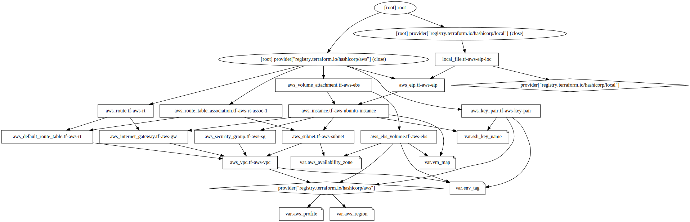

# rapsqlbench

- [rapsqlbench](#rapsqlbench)
  - [1. Prerequisites](#1-prerequisites)
  - [2. Terraform Graph](#2-terraform-graph)
  - [3. Usage](#3-usage)

## 1. Prerequisites

- [AWS Account](https://aws.amazon.com/premiumsupport/knowledge-center/create-and-activate-aws-account/)
- [AWS CLI](https://docs.aws.amazon.com/cli/latest/userguide/cli-chap-install.html)
- [Ansible](https://docs.ansible.com/ansible/latest/installation_guide/intro_installation.html#pip-install)
- [Terraform](https://learn.hashicorp.com/tutorials/terraform/install-cli)

## 2. Terraform Graph


**Terraform AWS Cloud Infrastructure of `rapsqlbench`.**

## 3. Usage

1. Clone this repository:

    ```bash
    git clone https://github.com/OpenSemanticWorld/rapsqlbench.git
    ```

2. Login to AWS via the CLI:

    ```bash
    aws configure sso --profile <profile-name>
    ```

3. Change directory to `rapsqlbench/terraform` and run `terraform init` to initialize the Terraform configuration:

    ```bash
    cd rapsqlbench/terraform; terraform init
    ```

4. Terraform Configuration:
   1. Create a `terraform.tfvars` file and set up your own variables there, or
   2. change the `variables.tf` file to match your desired configuration.
5. Run `terraform apply` depending on your `.tfvars` or `variables.tf` setup to create the infrastructure. Per default `variables.tf` will be used:

    ```bash
    terraform apply
    ```

6. To perform `rapsqlbench` via `ansible` from the `terraform` directory run for instance:

    ```bash
    ansible-playbook -i ./inventory/vm1k-eip.txt ../ansible/deploy.yml -e "triples=1000"
    ansible-playbook -i ./inventory/vm10k-eip.txt ../ansible/deploy.yml -e "triples=10000"
    ```
  
    The inventory text files are generated by Terraform and contain the public IP addresses of the created VMs. The `triples` variable is used to set the number of triples to be generated by `rapsqlbench`.
